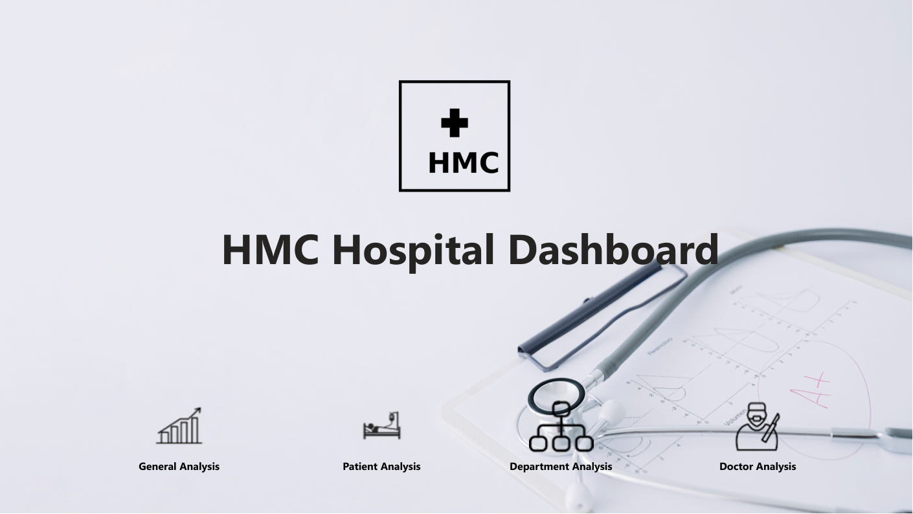
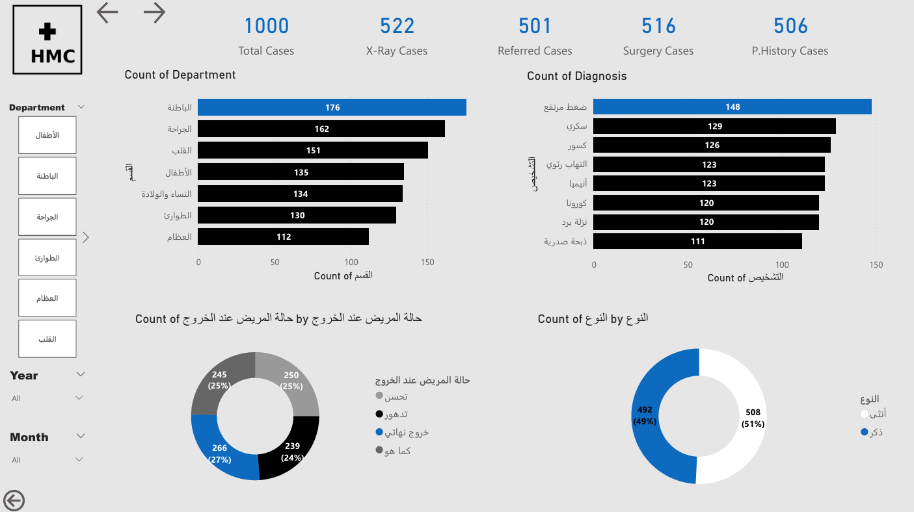
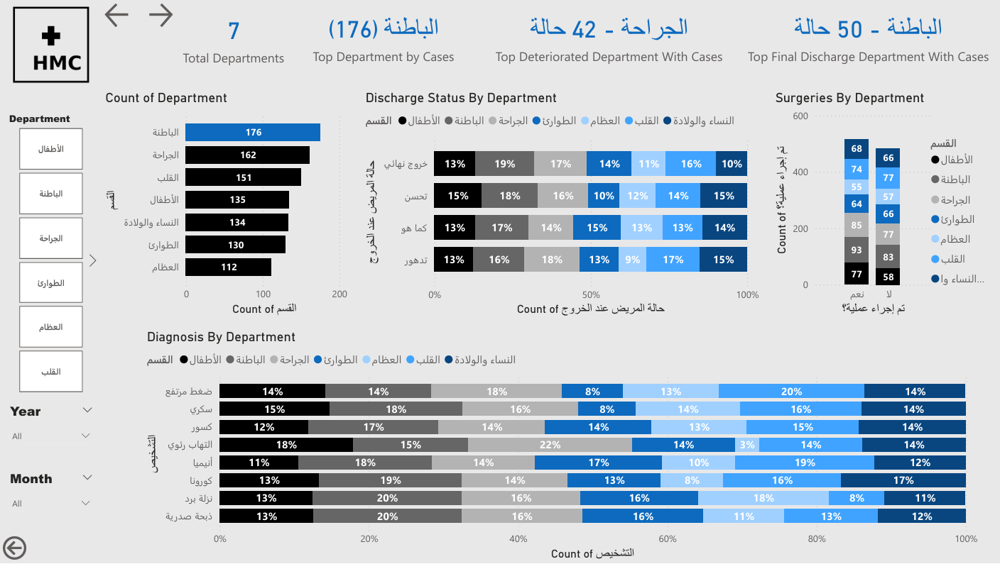
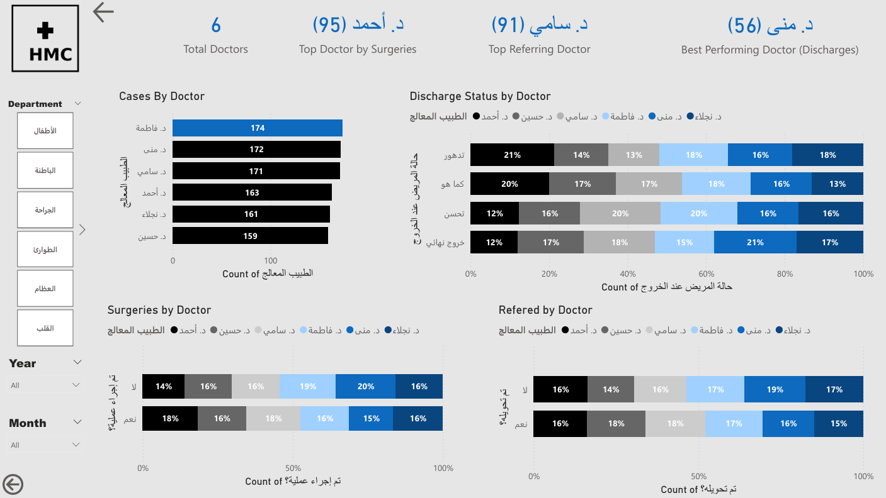

# 🏥 HMC Hospital Dashboard

## 📌 Project Overview

This project is a comprehensive healthcare analytics dashboard built using Power BI to analyze hospital performance, patient data, and operational efficiency.

The dashboard helps hospital management improve decision-making, optimize resources, and enhance patient outcomes through data-driven insights.

---

## 🎯 Objectives

* Analyze patient cases and medical diagnoses
* Evaluate department performance
* Track doctor productivity
* Understand patient demographics and trends

---

## 🛠️ Tools Used

* Power BI (Data Visualization)
* Excel (Data Source & Cleaning)

---

## 📊 Key Metrics

* **Total Cases:** 1000
* **Average Age:** 46
* **Average Stay:** 15 days
* **Returning Patients:** 51%

---

## 📈 Key Insights

### 🏥 Department Performance

* Internal Medicine is the busiest department with the highest number of cases.
* Indicates strong demand for chronic disease management.

---

### 🧬 Common Diagnoses

* Hypertension, Diabetes, and Fractures are the most frequent diagnoses.
* Reflects a high prevalence of chronic conditions.

---

### 👥 Patient Demographics

* Majority of patients fall within the 56–75 age group.
* Indicates increased healthcare demand among older populations.

---

### 👨‍⚕️ Doctor Performance

* Variation in doctor performance across surgeries and referrals.
* Highlights opportunities for better workload distribution.

---

### 📉 Patient Outcomes

* Patient discharge status is relatively balanced.
* Suggests room for improving treatment efficiency and recovery rates.

---

## 💡 Business Recommendations

* Increase capacity and staffing in Internal Medicine department
* Implement preventive healthcare programs for chronic diseases
* Optimize doctor workload distribution across departments
* Improve treatment protocols to enhance patient recovery outcomes

---

## 📊 Dashboard Preview

### 🏠 Home

---

### 📊 General Analysis

---

### 👥 Patient Analysis

---

### 🏥 Department Analysis

---

### 👨‍⚕️ Doctor Analysis

---

## 🚀 Conclusion

This dashboard provides a clear view of hospital operations and helps stakeholders identify trends, improve efficiency, and make informed decisions based on data.

---

## 👤 Author

**Hussini Eltawil**
Data Analyst | Power BI | SQL | Excel
