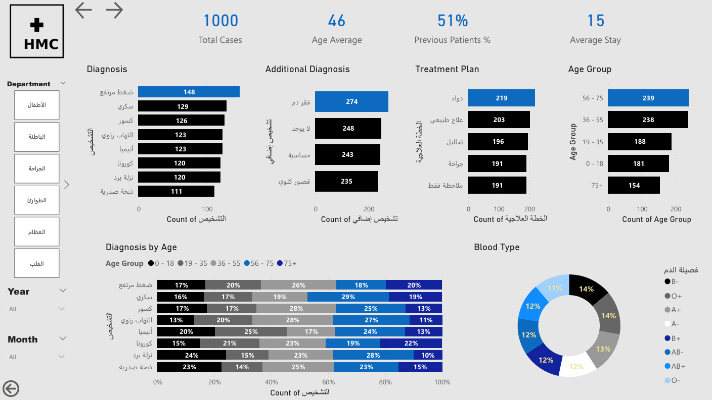

# HMC-Hospital-Dashboard
Hospital Data Analysis using Power BI

This dashboard helps hospital management monitor performance, optimize resources, and improve patient outcomes using data-driven insights.

## 📌 Project Overview
This project is a healthcare analytics dashboard built using Power BI to analyze hospital performance, patient data, and operational efficiency.

---

## 🛠️ Tools Used
- Power BI  
- Excel  

---

## 📊 Key Metrics
- Total Cases: 1000  
- Average Age: 46  
- Average Stay: 15 days  
- Returning Patients: 51%  

---

## 📈 Key Insights
- Internal Medicine is the busiest department  
- Most cases are related to chronic diseases  
- Majority of patients are aged 56–75  

---

## 📸 Dashboard Preview

### 🏠 Home

---

### 📊 General Analysis

---

### 👥 Patient Analysis

---

### 🏥 Department Analysis

---

### 👨‍⚕️ Doctor Analysis

---

## 👤 Author
Hussini Eltawil
